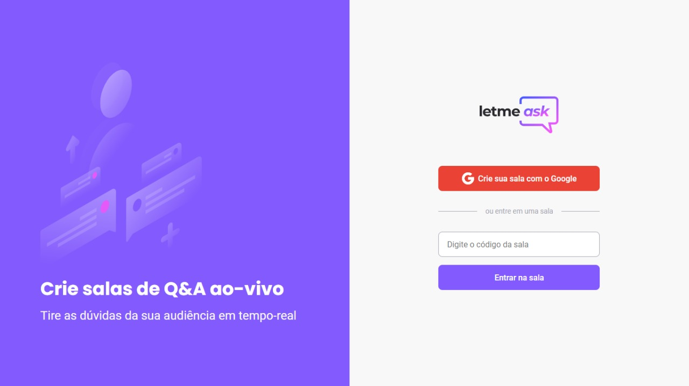

<p align="center">
    
</p>

<p align="center">
  <a href="#-sobre">Sobre</a>&nbsp;&nbsp;&nbsp;|&nbsp;&nbsp;&nbsp;
  <a href="#-tecnologias">Tecnologias</a>&nbsp;&nbsp;&nbsp;|&nbsp;&nbsp;&nbsp;
  <a href="#-layout">Layout</a>&nbsp;&nbsp;&nbsp;|&nbsp;&nbsp;&nbsp;
  <a href="#-como-executar">Como executar</a>&nbsp;&nbsp;&nbsp;|&nbsp;&nbsp;&nbsp;
  <a href="#-licença">Licença</a>
</p>

<p align="center">


</p>

<h1 align="center">
    
</h1>

<br/>

## 💻 Sobre

Letmeask é uma plataforma para criadores de conteúdos, onde eles podem criar salas com o seu público. A plataforma possui uma área para o administrador da sala, onde ele pode marcar a pergunta já como respondida, e até mesmo encerrar uma sala. 

Este projeto foi desenvolvido durante a **[Next Level Week Together](https://nextlevelweek.com/)**, apresentada dos dias 20 a 27 de Junho de 2021.

<br/>

## 🧪 Tecnologias

Esse projeto foi desenvolvido com as seguintes tecnologias:

- [React](https://reactjs.org)
- [Firebase](https://firebase.google.com/)
- [TypeScript](https://www.typescriptlang.org/)

<br/>

## 🔖 Layout

Você pode visualizar o layout do projeto através do link abaixo:

- [Layout Web](https://www.figma.com/file/u0BQK8rCf2KgzcukdRRCWh/Letmeask/duplicate) 

Lembrando que você precisa ter uma conta no [Figma](http://figma.com/).

<br/>

## 🚀 Como executar

Clone o repositório

```bash
# Clone o repositório
$ git clone https://github.com/Wesley45/letmeask.git

# Entre no repositório
$ cd letmeask

# Instalar as dependências
$ yarn install

# Realize a configuração do SDK do Firebase
# No arquivo .env.example
# Altere o nome do arquivo para .env.local

# Iniciar o projeto
$ yarn start
```

O app estará disponível no seu browser pelo endereço http://localhost:3000.

<br/>

## 📝 Licença

Esse projeto está sob a licença MIT. Veja o arquivo [LICENSE](LICENSE.md) para mais detalhes.

---

<br/>

### Autor

---

<a href="https://blog.rocketseat.com.br/author/thiago/">
 
 <br />
 <sub><b>Wesley Santos</b></sub></a> <a href="https://github.com/Wesley45/" title="Wesley Santos">🚀</a>


Feito com ❤️ por Wesley Santos!

[](https://www.linkedin.com/in/wesley-santos-051383149/)